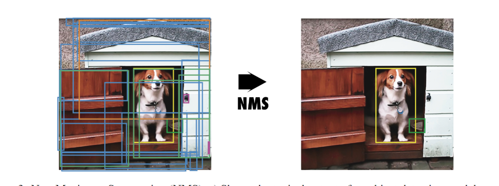
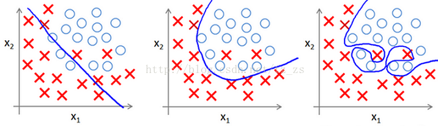

>**confusion matrix** 混淆矩阵，在机器学习和统计学中，用于评估分类模型性能的矩阵。它显示了模型预测结果与实际标签之间的对应关系，可以用于计算准确率、召回率、精确率等指标。在yolo训练结果run/train中生成了混淆矩阵图，横轴为真实值，纵轴为预测值

>**YOLO** you only look once，实时的端到端物体检测方法

>**bounding box**边界框，几何学中用于包围点集的最小框，可以测量点集的面积、体积或超体积。计算机视觉算法通过识别边界框来准确检测物体。

>**Region Proposal** 区域提案，在计算机视觉中，指的是一种用于目标检测和图像分割的算法，通过生成候选区域来提供可能包含目标的图像区域。

>**ground truth** GT 地面实况：通过直接观察获得的信息，而不是通过推断获得的信息。研究人员使用地面实况数据来验证他们的模型的准确性。
>
> 整个ground truth 为：
> $S * S * (B * 5 + C)$
> S * S：grid 的数量
> B：每个框预测的bounding box 的数量
> 5：bounding box的量，分别是中心位置(x,y)，高(h)，宽(w)，以及置信度
> C：分类器可以识别的物体数

>**IOU** intersection over union，交并比，在检测任务中，使用交并比(Intersection of Union，IOU)作为衡量指标,来描述两个框之间的重合度。 $IOU = \frac{A \cap B}{A \cup B} $


>**confidence** 置信度 $C = Pr(obj) * IOU^{pred}_{truth}$

>**one-hot**  一位有效编码：一种编码方式，其中一个向量的所有元素都为0，除了一个元素为1。这种编码常用于表示类别变量，如机器学习中的类别标签。

>**NMS** 非极大值抑制 Non-maximum suppression(NMS)，非极大值抑制（NMS）是物体检测算法中使用的一种后处理技术，用于减少重叠边界盒的数量，提高整体检测质量。
>
>物体检测算法通常会在同一物体周围产生多个具有不同置信度分数的边界框。NMS过滤掉多余的和不相关的边界盒，只保留最准确的边界盒。
>
>算法1描述了该程序。图3显示了一个包含多个重叠边界框的物体检测模型的典型输出和NMS之后的输出。
>```
>Algorithm 1 Non-Maximum Suppression Algorithm
>Require: Set of predicted bounding boxes B, confidence scores S, IoU threshold τ , confidence threshold T
>Ensure: Set of filtered bounding boxes F
>1: F ← ∅
>2: Filter the boxes: B ← {b ∈ B | S(b) ≥ T}
>3: Sort the boxes B by their confidence scores in descending order
>4: while B ̸= ∅ do
>5:      Select the box b with the highest confidence score
>6:      Add b to the set of final boxes F: F ← F ∪ {b}
>7:      Remove b from the set of boxes B: B ← B − {b}
>8:      for all remaining boxes r in B do
>9:          Calculate the IoU between b and r: iou ← IoU(b, r)
>10:         if iou ≥ τ then
>11:             Remove r from the set of boxes B: B ← B − {r}
>12:         end if
>13:     end for
>14: end while
>```
>


>**MSE** mean square error 均方误差

>**precision** 检测出来的条目中有多大比例是我们需要的

>**recall** 所有我们需要的条目有多大比例被检测出来了

>**PR曲线** 我们希望precision 和 recall 越大越好，但两个在某些情况是矛盾的

>**AP** average precision 平均精度 简单来说就是对PR曲线上的Precision值求均值 $AP=\int_0^1{p(r)dr}$

>**mAP** mean average precision，对coco数据集，mAP是AP值在所有类别下的均值。在这里，在coco的语境下AP便是mAP，这里的AP已经计算了所有类别下的平均值，这里的AP便是mAP。

>**COCO** 数据集common objects in context

>**BP** back-propagation 反向传播

>**CBL** Conv+Bn+Leaky_relu

>**CSP**  Cross Stage Partial，其初衷是减少计算量并且增强梯度的表现
>论文：[CSPNet: A New Backbone that can Enhance Learning Capability of CNN](https://arxiv.org/pdf/1911.11929.pdf) 

>**ResNet** Residual Neural Network 残差神经网络
>论文：[Deep Residual Learning for Image Recognition](https://arxiv.org/abs/1512.03385)
>
>残差神经网络的主要贡献是发现了“退化现象（Degradation）”，并针对退化现象发明了 “快捷连接（Shortcuts, skip connection）”，有助于训练过程中梯度的反向传播，极大的消除了深度过大的神经网络训练困难问题。神经网络的“深度”首次突破了100层、最大的神经网络甚至超过了1000层。

>**DenseNet** 的基本思路与ResNet一致，但是它建立的是前面所有层与后面层的密集连接（dense connection），它的名称也是由此而来。
>
>DenseNet的另一大特色是通过特征在channel上的连接来实现特征重用（feature reuse）。这些特点让DenseNet在参数和计算成本更少的情形下实现比ResNet更优的性能，DenseNet也因此斩获CVPR 2017的最佳论文奖。

>**SPP** spatial pyramid pooling 空间金字塔池

>**Concat**  concatenate

>**Conv** convolution 卷积和多项式相乘 ，Conv模块是卷积神经网络中常用的一种基础模块，它主要由卷积层、BN层和激活函数组成。 Conv = Conv2d + BN + SILU

>**BN** Batch Normalization BN层是在卷积层之后加入的一种归一化层，用于规范化神经网络中的特征值分布，往往用在深度神经网络中激活层之前。其作用可以加快模型训练时的收敛速度，使得模型训练过程更加稳定，避免梯度爆炸或者梯度消失。并且起到一定的正则化作用，几乎代替了Dropout。
>看这个，还是不太懂[【基础算法】六问透彻理解BN(Batch Normalization）](https://zhuanlan.zhihu.com/p/93643523)

>**dropout** 随机失活 
>全连接层由于参数过于庞大，因此很容易出现过拟合，那么每次迭代的时候把一些神经元以概率p失活，这样每次迭代时都是一个新的模型，显著提高了健壮性（Robust），某种意义可以看做通过集成不同的模型来提高泛化能力
>
>它将每一个隐藏神经元的输出以50%的概率设为0。以这种方式“dropped out”的神经元既不参与前向传播，也不参与反向传播。每次做完dropout，相当于从原始的网络中找到一个更瘦的网络，有了dropout之后，可以将一个大网络看作多个小网络的组合，dropout能够有效地防止过拟合。

>**ReLU** Rectified Linear Unit，ReLU函数在输入大于0时直接输出，否则输出0。它的数学形式为f(x) = max(0, x)，可以看作是一个分段函数，具有非常好的计算性质，使得神经网络的训练更加高效。
>

>**Leaky relu**  leaky 有漏洞的
>Leaky ReLU是ReLU的一种变体，改变之处在于 负数的输出不再是0了，而是一个很小的数值，比如0.1或0.01。
>
>Leaky ReLU的优点在于可以避免出现“神经元死亡”的情况，即在训练过程中某些神经元的输出始终为0，从而导致无法更新其权重，而Leaky ReLU可以在一定程度上解决这个问题。

>**SiLU** Sigmoid Linear Unit 相对于ReLU函数，SiLU函数在接近零时具有更平滑的曲线，并且由于其使用了sigmoid函数，可以使网络的输出范围在0和1之间。这使得SiLU在一些应用中比ReLU表现更好，例如在语音识别中使用SiLU比ReLU可以取得更好的效果。

>**激活函数** 是一种非线性函数，用于给神经网络引入非线性变换能力。常用的激活函数包括sigmoid、ReLU、LeakyReLU、ELU等。它们在输入值的不同范围内都有不同的输出表现，可以更好地适应不同类型的数据分布。

>**res unit**

>**Focus**

>**slice**

>**maxpool**

>**indice** 指数

>**transpose** 转置

>**CNN** convolutional neural network 卷积神经网络

>**tensor** 张量

>**pooling** 池化 卷积特征往往对应某个局部的特征。要得到global的特征需要将全局的特征执行一个aggregation（聚合）。池化就是这样一个操作，对于每个卷积通道，将更大尺寸（甚至是global）上的卷积特征进行pooling就可以得到更有全局性的特征。这里的pooling当然就对应了cross region。

>**max pooling** 最大池化，整个图片被不重叠的分割成若干个同样大小的小块（pooling size）。每个小块内只取最大的数字，再舍弃其他节点后，保持原有的平面结构得出 output。
>参考：[对Max Pooling的理解](https://blog.csdn.net/weixin_41513917/article/details/102514739)

>**pool和pooling的区别**
>pool 在英语中是一个名词，它的基本意思是“池，水塘，石油层，联营”。在计算机科学领域，“pool”有时也被用来指代资源集合，如数据库连接池。
>
>pooling 是一个动词或名词的现在分词形式，它的基本意思是“合伙经营，共享，采掘，汇聚成”。在计算机科学领域，pooling一般指代一种数据处理技术，特别是在图像处理和深度学习领域，它也被用来指代资源管理技术中的资源池化。
>
>总的来说，pool和pooling虽然都与“池”这个概念有关，但它们在具体语境中的含义和用法可能有所不同。
>
>在计算机科学领域，pooling更倾向于表示一种数据处理或资源管理技术，而pool则可能表示资源集合或一般的池的概念。

>**SOTA** state-of-the-art 最先进的

>**FP** false positive 假阳性，在检测或诊断过程中，错误地将不存在的问题或病状判断为存在的现象。

>**SGD** stochastic gradient descent 随机梯度下降

>**HOG** Histogram of oriented gradients 方向梯度直方图

>**k-means clustering** k均值聚类，它的基本思想是，通过迭代寻找K个簇（Cluster）的一种划分方案，使得聚类结果对应的损失函数稳定，其中，损失函数可以定义为各个样本距离所属簇中心点的误差平方和。
>参考：<https://zhuanlan.zhihu.com/p/184686598>

>**softmax** Softmax从字面上来说，可以分成soft和max两个部分。max故名思议就是最大值的意思。
>
>对于max我们都很熟悉，比如有两个变量a,b。如果a>b，则max为a，反之为b。用伪码简单描述一下就是 if a > b return a; else b。
>
>另外一个单词为soft。max存在的一个问题是什么呢？如果将max看成一个分类问题，就是非黑即白，最后的输出是一个确定的变量。更多的时候，我们希望输出的是取到某个分类的**概率**，或者说，我们希望分值大的那一项被经常取到，而分值较小的那一项也有一定的概率偶尔被取到，所以我们就应用到了soft的概念，即最后的输出是每个分类被取到的概率。
>
>下面给出Softmax函数的定义（以第i个节点输出为例）：
$Softmax(z_i)=\frac{e^{z_i}}{\sum_{c=1}^{C}{e^{z_c}}}$
>其中,$z_i$为第i个节点的输出值，C为输出节点的个数，即分类的类别个数。通过Softmax函数就可以将多分类的输出值转换为范围在[0, 1]和为1的概率分布。
>参考：<https://blog.csdn.net/bitcarmanlee/article/details/82320853>

>**sigmoid**函数，Sigmoid函数是理解神经网络如何学习复杂问题的关键。这个函数也是学习其他函数的基础，这些函数可以为深度学习架构中的监督学习提供高效的解决方案。它是一个非线性S形函数，它的域是所有实数的集合，范围是(0,1)。因此作为神经元的激活函数，这个单元的输出保证总是介于0和1之间。
>参考：<https://zhuanlan.zhihu.com/p/424858561>
>$S(x)=\frac{1}{1+e^{-x}}$
>$S'(x)=\frac{e^{-x}}{(1+e^{-x})^2}=S(x)(1-S(x))$
[](>)
>


>**hyperparameter** 超参，在机器学习的上下文中，超参数是在开始学习过程之前设置值的参数，而不是通过训练得到的参数数据。通常情况下，需要对超参数进行优化，给学习机选择一组最优超参数，以提高学习的性能和效果

>**Backbone**主干，负责从输入图像中提取有用的特征。
>它通常是一个卷积神经网络（CNN），在大规模的图像分类任务中训练，如ImageNet。
>
>骨干网在不同的尺度上捕捉层次化的特征，在较早的层中提取低层次的特征（如边缘和纹理），在较深的层中提取高层次的特征（如物体部分和语义信息）
>
>运行在GPU上的检测器的主干如VGG，ResNet，ResNetXt，DenseNet
>运行在CPU上的检测器的主干如SqueezeNet、MobileNet或ShufflfleNet

>**Neck**，是连接Backbone和Head的一个中间部件。
>近年来开发的目标探测器经常在主干和头部之间插入一些层，这些层通常用于收集不同阶段的特征图，将图像特征传递到预测层。
>
>它聚集并细化骨干网提取的特征，通常侧重于加强不同尺度的空间和语义信息。颈部可能包括额外的卷积层、特征金字塔网络（FPN），或其他机制，以提高特征的代表性。
>
>通常，颈部由几条自下向上的路径和几条自上向下的路径组成。配备这种机制的网络包括特征金字塔网络(FPN)、路径聚合网络(PAN)、BiFPN和NAS-FPN

>**Head**，是物体检测器的最后组成部分。
>它负责根据Backbone和Neck提供的特征进行预测。它通常由一个或多个特定任务的子网络组成，执行分类、定位，以及最近的实例分割和姿势估计。头部处理颈部提供的特征，为每个候选物体产生预测。最后，一个后处理步骤，如非极大值抑制（NMS），过滤掉重叠的预测，只保留置信度最高的检测。
>
>用于预测物体的类和边界框，Dense Prediction, Sparse Prediction，通常可分为一级目标探测器和两级目标探测器两类。
>两级目标探测器是R-CNN系列，包括Fast R-CNN、Faster R-CNN、R-FCN和Libra R-CNN
>
>也可以使一个两级目标检测器成为一个无锚点的目标检测器，如反应点。
>单级目标探测器，最具代表性的模型是YOLO、SSD和RetinaNet。
>近年来，无锚的单级目标探测器已经发展起来。这类检测器有CenterNet、CornerNet、FCOS等。
>参考论文：[YOLOv4：Optimal Speed and Accuracy of Object Detection](https://readpaper.com/pdf-annotate/note?pdfId=4500345772876390401&noteId=2010198285949619456)


>**FPN** feature pyramid network 特征金字塔网络
>特征金字塔的结构主要包括三个部分：bottom-up，top-down和lateral connection。

>**PAN**  PANet [Path Aggregation Network for Instance Segmentation](https://arxiv.org/abs/1803.01534)
>FPN是自上向下的一个特征金字塔，把高层的强语义特征传递下来，对整个金字塔进行增强，不过它只增强了语义信息，却对定位信息没有传递（或者说是因为向上传递路径太长，传递效果不好）。PAN就是针对这一点，在FPN的后面添加一个自下向上的金字塔，对FPN进行补充，将低层的定位特征传递上去，这样形成的金字塔既结合了语义信息又拥有定位信息，“双杀”

>**Object detector**，一个普通的物体探测器由“特征输入、骨干网络、颈部和头部”组成

>**RF**,receptive field 感受野 接受域

>**cross entropy** 交叉熵，多分类问题中，经常使用交叉熵作为损失函数

>**VGG** VGG是Oxford的Visual Geometry Group的组提出的（大家应该能看出VGG名字的由来了）。该网络是在ILSVRC 2014上的相关工作，主要工作是证明了增加网络的深度能够在一定程度上影响网络最终的性能。
>
>VGG有两种结构，分别是VGG16和VGG19，两者并没有本质上的区别，只是网络深度不一样。
>论文：[Very Deep Convolutional Networks for Large-Scale Image Recognition](https://arxiv.org/abs/1409.1556)
>参考：[一文读懂VGG网络](https://zhuanlan.zhihu.com/p/41423739)

>**SVM** support vector machines 支持向量机

>**ONNX** 开放神经网络交换（Open Neural Network Exchange），是微软和Facebook提出用来表示深度学习模型的开放格式。所谓开放就是ONNX定义了一组和环境，平台均无关的标准格式，来增强各种AI模型的可交互性。

>**anchor-based** 和 **anchor-free**
>当谈到目标检测算法时，"anchor-based"和"anchor-free"是两种常见的方法。
>
>Anchor-based方法是一种基于锚框（anchor）的目标检测方法。锚框是一些预定义的边界框，通常是以不同尺度和长宽比例在图像上均匀分布的。这些锚框用于在图像中生成候选框，并与真实目标框进行匹配。通过计算锚框与真实目标框之间的偏移量，可以预测目标的位置和类别。
>常见的锚框算法包括Faster R-CNN和RetinaNet。
>
>Anchor-free检测器因其更好的泛化能力和解码预测结果的简单性而脱颖而出。其后期处理的时间成本大大降低。
>有两种类型的Anchor-free检测器：基于锚点和基于关键点。在YOLOv6中，我们采用了基于锚点的范式，其回归分支实际上预测了从锚点到box四边的距离
>这种方法通常使用密集的候选框或者特征点来表示目标位置。一些常见的anchor-free方法包括CenterNet和CornerNet。
>
>**比较**
>Anchor-based方法通常在目标检测任务中表现较好，因为锚框可以提供更多的位置和尺度信息，但它们需要额外的计算来匹配锚框和真实目标框。
>Anchor-free方法则更加简洁，减少了匹配过程的复杂性，但可能在小目标检测和密集目标检测等方面表现较差。

>**KD** Knowledge Distillation **知识蒸馏**，顾名思义，就是将已经训练好的模型包含的知识(”Knowledge”)，蒸馏("Distill")提取到另一个模型里面去。
>知识蒸馏是一种模型压缩方法，是一种基于“教师-学生网络思想”的训练方法，由于其简单，有效，在工业界被广泛应用。
>Teacher model：原始模型训练，Net-T
>Student model：精简模型训练，Net-S
>KD训练过程与传统训练过程对比：
>>传统training过程(hard targets): 对ground truth求极大似然
>>KD的training过程(soft targets): 用large model的class probabilities作为soft targets
>
>论文：[Distilling the Knowledge in a Neural Network](https://arxiv.org/pdf/1503.02531.pdf)
>**推荐直接参考：**[【经典简读】知识蒸馏(Knowledge Distillation) 经典之作](https://zhuanlan.zhihu.com/p/102038521)，写的很好

>**underfitting** 欠拟合（左1图），即模型没有学到数据内在关系，如下图左一所示，产生分类面不能很好的区分X和O两类数据；产生的深层原因，就是模型假设空间太小或者模型假设空间偏离。
>**overfitting** 过拟合（右1图），即模型过渡拟合了训练数据的内在关系，如下图右一所示，产生分类面过好地区分X和O两类数据，而真实分类面可能并不是这样，以至于在非训练数据上表现不好；产生的深层原因，是巨大的模型假设空间与稀疏的数据之间的矛盾。
>
>实战中，可基于模型在训练集和测试集上的表现来判断：
>|训练集表现|测试集表现|问题|
>|:--:|:--:|:--:|
>|<预期|<预期|欠拟合|
>|>预期|接近训练集|合适|
>|>预期|<<训练集|过拟合|

>**regression** 回归，用人话说，就是用给定的数据“倒推”实现从输入到输出的模型，即回归模型。
>
>回归是监督式学习的一种形式
>
>举个线性回归例子，给定一组二维坐标系上的点（一元线性回归），倒推其对应的直线，让该直线尽可能拟合给定的点。倒推的该直线即是线性回归模型。
>
>但真实值总是与理论值有误差的，这个误差我们用损失函数表示，而计算回归就是让损失函数尽量的小。

>**损失函数** Loss 损失函数，也有的叫目标函数，是衡量回归模型误差的函数，这个函数的值越小，说明模型越能拟合我们的数据。
>损失函数也可以理解是网络模型的预测结果与数据集之间的距离，网络不断优化的主要目的就是减小预测结果和真实数据之间的距离。
>常用残差平方和、均方根误差等作为机器学习中回归问题的损失函数。为了让损失函数尽可能接近0（稳定），使用最小二乘估计、梯度下降等方法。

>**最小二乘法** [一文让你彻底搞懂最小二乘法（超详细推导）](https://blog.csdn.net/MoreAction_/article/details/106443383)

>**梯度下降** Gradient-Descent 
>梯度下降法在机器学习中常常用来优化损失函数，是一个非常重要的工具。
>参考：[Gradient-Descent (梯度下降，优化函数大法)](https://mp.weixin.qq.com/s/EXumVg7EPcl0ZeRVeUk82g)

>**TOOD** Task-aligned One-stage Object Detection 任务对齐的单阶段目标检测

>**卷积核与通道**
[CNN卷积核与通道讲解](https://zhuanlan.zhihu.com/p/251068800)
>多通道卷积过程举例：输入一张三通道的图片，这时有多个卷积核进行卷积，并且每个卷积核都有三通道，分别对这张输入图片的三通道进行卷积操作。每个卷积核，分别输出三个通道，这三个通道进行求和，得到一个featuremap，有多少个卷积核，就有多少个featuremap
>>输入通道个数 = 卷积核通道个数
>>卷积核个数 = 输出通道个数

>**top-1 error rate** 如果概率最大的是正确答案，才认为正确。Top-1 = （正确标记 不是 模型输出的最佳标记的样本数）/ 总样本数。

>**top-5 error rate** 一个图片经过网络，得到预测类别的概率，如果概率前五（top-5）中包含正确答案，即认为正确。top-5错误率就是Top-5 = （正确标记 不在 模型输出的前5个最佳标记中的样本数）/ 总样本数