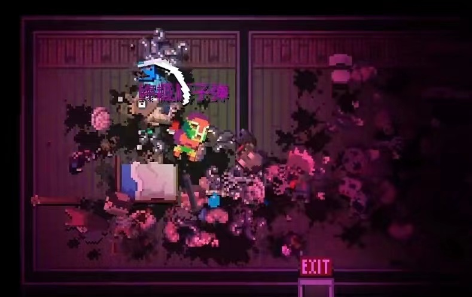
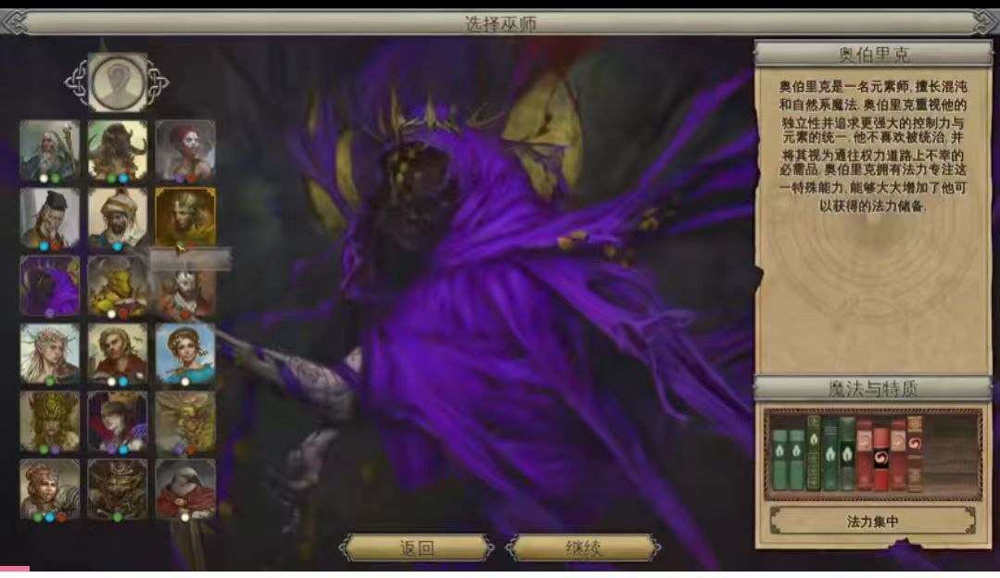

---
toc:
  depth_from: 1
  depth_to: 6
  ordered: false 
---

传奇守护者

[toc]

---
### 背景

---
### 角色美术
像素方块，类似方块地牢里的角色

合成：血祭 吞噬 奉献
特效：白光、绿光、橙光、红光
音效

相同兵种合成，技能进阶。
不同兵种合成，技能增加。

每次不同兵种合成新增一个技能。

兵种合成有几率合成其它技能。

---
### 职业

#### 东方
赶尸人：僵尸先生
道士：五雷正法，诸邪辟易
武僧：金刚不坏
游侠：百般手段
巡捕：侦探大师
医者：治病救人
蛊师：蛊虫毒虫
方士：阵法咒术，驱鬼招魂

#### 西方
战士：无畏冲锋
法师：法术无敌
术士：无敌法术，沟通异界
牧师：驱魔恢复
刺客：暗影无形
游侠：弓箭精通，生存大师
死灵法师：召唤亡灵

---
### 技能

初始一阶士兵只有白色技能。
技能池，不同阶有不同的技能

遣散兵种花费军资获得军械

---
### 匹配
单机，但是可以通过事件与其它玩家PK
PK匹配规则：队伍规模，建筑总等级
PK需要双方确认后开始
也可以开房PK，
PK可以掠夺破坏对方建筑

---
### 场景
#### 低阶
战场、山寨、火山、海港
#### 中阶
遗迹、魔兽山、怪物巢穴、竞技场、沙漠
#### 高阶
域外、地下城、深渊、天空、异界、

---
### 装备
#### 药剂
#### 武器装备
#### 宠兽
#### 战争器械
#### 坐骑

---
### 英雄
极低概率能过的特殊英雄
兵种升级到属性超过一定值，可以转职为英雄

---
### 队伍
#### 佣兵队伍
没有英雄，接取雇佣任务，猎杀盗贼，参与战争，赚取资金，购买军械，招募士兵。

佣兵队伍积累资金

#### 冒险者小队
具有至少一位英雄，猎杀魔兽和盗贼，探险遗迹，与传说生物战斗。解锁冒险者营地，雇佣

冒险者小队拥有移动营地

#### 传奇组织
所有成员都是英雄，晋升为传说队伍，被邀请进入更危险的地方处理危机。解锁后勤支持，拥有小镇

传奇组织经营根据地

#### 守护者组织
队伍中有一个英雄达到成为守护者的选拔资格，进入更危险的地域历练，参加守护者挑战后，有资格的英雄自动成为被选拔者，带领队伍击败其它守护者选拔小队

守护者组织建造城镇

---
### 招募
佣兵队伍只能招募到士兵，有极小概率招募到特殊士兵，能极快成长为英雄（自带晋升任务或满足升级条件）

冒险者小队能吸引到一些处于负面状态的英雄，同时能招募普通士兵参加战斗

传说队伍只能招募英雄参加战斗，或者招募普通人经营小镇

守护者选拔队伍接受守护者挑战后不能再招募其它人员，在挑战中如果队伍中的被选拔者全部被击败，则挑战失败。挑战成功获得守护者之证

在角色头像底部用颜色标识职业和属性

---
### 机制
心情、需求、俘虏、退出
每一位英雄都有心情和需求，如果心情低，需求不满足，有一定概率请求退出队伍
负伤 死亡
被俘虏的英雄，可以用赎金赎回。但如果被招募，则会失去该英雄

---
### 战斗
清理杂兵，与方块地牢类似，小队在平面上清扫地图
遇到BOSS，可以选择是否进入决斗空间战斗，在决斗空间中类似于BOSS战，排兵布阵，而不进入决斗空间时与清理杂兵一样，但会有杂兵闯入

掠夺获得军资和军械